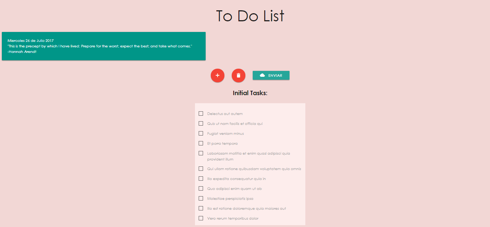
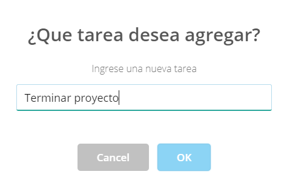
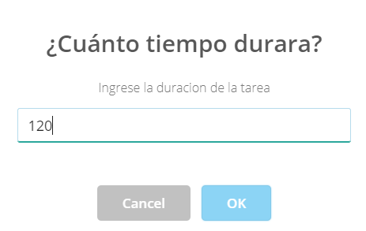
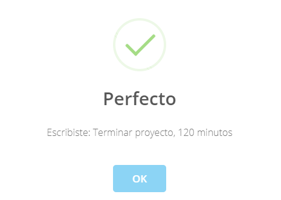
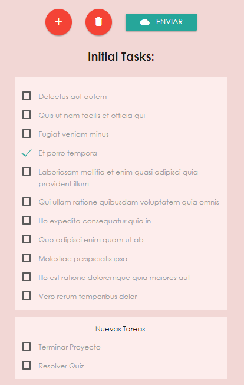

# Lista de tareas

Proyecto Final Sprint II To Do List

**1. HTML**
+ Título: "To Do List"  El cual se realizo con un tamaño h1
+ Presentación: "Para añadir una tarea haga click en + y escriba un task..." 
  Se refiere a las instrucciones de uso, se realizo con una tarjeta div
+ Se 3 botones con estilos de la libreria Materialize
+ Se agrego un div *lista* en el cual se mostrara el conjunto de tareas
+ Se agrego un segundo div *sin id* para seccionar los botones
+ Un tercer div *lista nueva* en el que se mostrar las nuevas tareas

**2. CSS**
+ Se uso para la colocación de de estilos de botones, fondo y diseño de lista.
+ Fuentes: tipo de letra usada "Centuri Gothic"
+ Body Background: color de fondo "#F2D7D5"
+ Body Color: color de letra "Black"
+ Buttom: Descripción de tamaño, color de fondo del botón, color de letra y bordes.
+ Se le enlazo la librería Materialize para dar un mejor aspecto

**3. JAVASCRIPT**
+ Se creo un array que contuviera los datos inicialmente presentados.
+ Se agregaron elementos de la lista mediante JS.
+ Se crearon dos objetos para la captura y reserva de datos.
+ Se usaron funciones para la captura de datos e impresión de los mismos.
+ Se hizo uso de funciones sweetAlert

## Resultado
*Portada de entrada*

*Boton Añadir Tarea*

*Tarea añadida*

*Nuevas tareas agregadas en lista*
